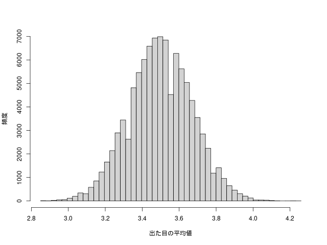

# 中心極限定理 (central limit theorem)

> このページで使用したRのソースコードは[こちら](../script/clt.R)から参照できます。

1から6のどの目も等しい確率で出るサイコロが1つある。
このサイコロを例えば10万回投げ、出た目の数を集計しヒストグラムを作成した。

どの目が出る確率も等しいのだから、上のような平らなグラフができる。

> 通常、階級は「○○以上△△未満」のように設定するが、ここでは各階級を単に1から6の整数値としてしまっている。

次に、どの目も等しい確率で出るサイコロを2つ用意する。
2つのサイコロを投げ、出た目を足して2で割る。
つまり、平均値を計算する。
これを10万回繰り返せば、平均値を10万個集められる。
10万個の平均値のヒストグラムを作成した。

おにぎりの形になった！

> 重心が左に寄ってしまったが、階級の取り方を工夫すれば直せるはず。

今度はサイコロを3つにして、出た目の平均値を計算する。
これを10万回繰り返し、10万個の平均値のヒストグラムを作成した。

サイコロ2個の平均値のグラフよりも尖った山になった。

思い切って、サイコロの数を100個にしてみよう。
今までと同じように平均値を集計してヒストグラムを作成した。

