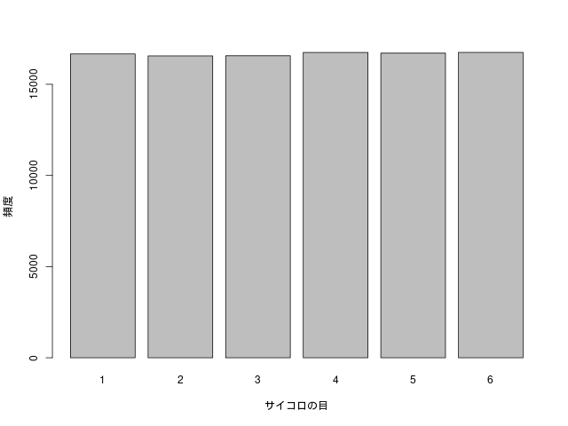

# 中心極限定理 (central limit theorem)

> このページで使用したRのソースコードは[こちら](../script/clt.R)から参照できます。

# サイコロを投げる実験

1から6のどの目も等しい確率で出るサイコロが1つある。
このサイコロを例えば10万回投げ、出た目の数を集計しヒストグラムを作成する。

どの目が出る確率も等しいのだから、上のような平らなグラフができる。

> 通常、階級は「○○以上△△未満」のように設定するが、ここでは各階級を単に1から6の整数値としてしまっている。
> もはや棒グラフである。

次に、どの目も等しい確率で出るサイコロを2つ用意する。
2つのサイコロを投げ、出た目を足して2で割る。
つまり、平均値を計算する。
これを10万回繰り返せば、平均値を10万個集められる。
10万個の平均値のヒストグラムを作成した。

おにぎりの形になった！

> 重心が左に寄ってしまったが、階級の取り方を工夫すれば直せるはず。

今度はサイコロを3つにして、出た目の平均値を計算する。
これを10万回繰り返し、10万個の平均値のヒストグラムを作成した。

サイコロ2個の平均値のグラフよりも尖った山になった。

思い切って、サイコロの数を1000個にしてみよう。
今までと同じように平均値を集計してヒストグラムを作成した。

なめらかな山ができた。
横軸に注目すると、平均値が3.5付近に集中していることが読み取れる。

ひとつひとつのサイコロの出る目は、初めのヒストグラムのように1から6の範囲で均等であった。
しかし、サイコロをたくさん集めて投げたときの平均値は、1から6の範囲で均等でなく、ある特定の値に集中している。

# 実は正規分布に近づいている

今使っているサイコロは、どの目が出る確率も$\dfrac{1}{6}$であった。
このサイコロ1つをを1回投げた時、出る目の期待値は、
$$
\mu = 1 \times \frac{1}{6} + 2 \times \frac{1}{6} + 3 \times \frac{1}{6} + 4 \times \frac{1}{6} + 5 \times \frac{1}{6} + 6 \times \frac{1}{6} = 3.5
$$
である。
分散は、
$$
\sigma^2 = (1 - 3.5)^2 \times \frac{1}{6} + (2 - 3.5)^2 \times \frac{1}{6} + (3 - 3.5)^2 \times \frac{1}{6} + (4 - 3.5)^2 \times \frac{1}{6} + (5 - 3.5)^2 \times \frac{1}{6} + (6 - 3.5)^2 \times \frac{1}{6} = \frac{35}{12} = 2.92
$$
である。

ところで、確率分布のグラフは（一般に）曲線と横軸に挟まれた部分の面積が1になる。
それに倣って、先ほど作ったサイコロ100個のヒストグラムについて、色を塗った部分の面積が1になるよう縦軸に小細工を施そう。

このグラフに、（今さっき計算した値と同じ）平均3.5、（今さっき計算した分散をサイコロの個数1000で割った値である）分散$2.92/1000$の正規分布を書き加える。

ひったり重なったではないか！
