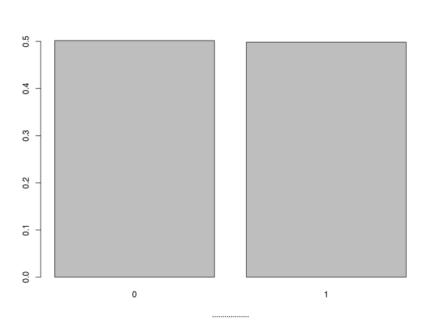
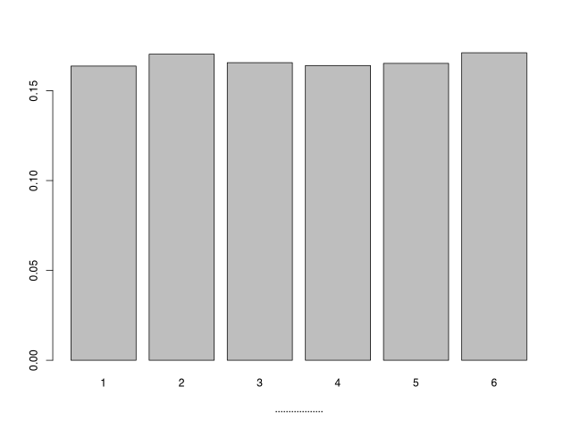

<!---
clt.mdは気に入らない部分が多かったので、ここで書きなおします。
-->

# 中心極限定理 (central limit theorem)

> このページで使用したRのソースコードは[こちら](../script/clt2.R)から参照できます。

## コインとサイコロを投げる実験――その1

手元にコインが1枚あります。
表の出やすさと裏の出やすさは同じとします。
それを投げて、表が出たら1を、裏が出たら0を記録します。
10000回投げた結果は次のようになりました。

縦軸は、全10000投に対する、表裏それぞれの回数の割合を示しています。

表と裏のどちらの出やすさも等しいので、高さの等しい棒グラフになりました。

手元にサイコロもあります。
1~6のどの目の出やすさも同じとします。
それを10000回投げたところ、それぞれの目の出た回数はつぎの図のようになりました。

縦軸は、それぞれの目が出た回数の割合を示しています。

サイコロのどの目の出やすさも等しいので、平らなグラフができました。

> 1枚のコインを1回投げるとき、確率変数を表の出る回数（つまり$`X`$は0または1をとる
）とすれば、$`P(X=0)=1/2`$, $`P(X=1)=1/2`$である。
> 1つのサイコロを1回投げるとき、確率変数を出た目（つまり$`X`$は1以上6以下の整数）とすれば、$`P(X=1)=1/6`$, $`P(X=2)=1/6`$, $`P(X=3)=1/6`$, $`P(X=4)=1/6`$, $`P(X=5)=1/6`$, $`P(X=6)=1/6`$となる。
> 上の2つの図は、これらの確率分布をグラフで表したものである。
