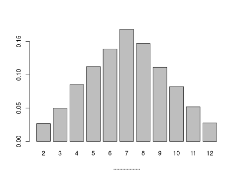
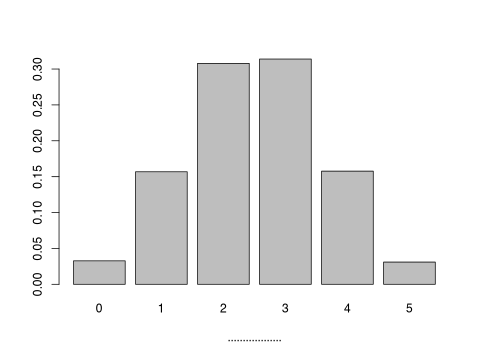
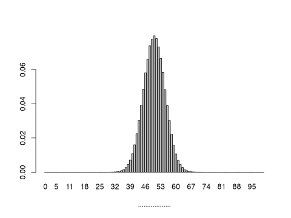
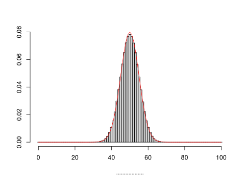
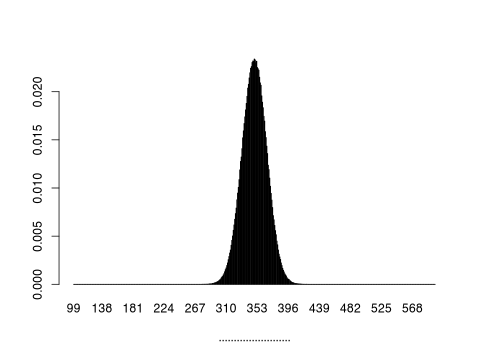

<!---
clt.mdは気に入らない部分が多かったので、ここで書きなおします。
-->

# 中心極限定理 (central limit theorem)

> このページで使用したRのソースコードは[こちら](../script/clt2.R)から参照できます。

## コインとサイコロを投げる実験――その1

手元にコインが1枚あります。
表の出やすさと裏の出やすさは同じとします。
それを投げて、表が出たら1を、裏が出たら0を記録します。
1万回投げた結果は次のようになりました。

縦軸は、全1万投に対する、表裏それぞれの回数の割合を示しています。
表と裏のどちらの出やすさも等しいので、高さの等しい棒グラフになりました。

手元にサイコロも1つあります。
1~6のどの目の出やすさも同じとします。
それを1万回投げたところ、それぞれの目の出た回数はつぎの図のようになりました。

縦軸は、それぞれの目が出た回数の割合を示しています。
サイコロのどの目の出やすさも等しいので、平らなグラフができました。

> 1枚のコインを1回投げるとき、確率変数を表の出る回数（つまり$`X`$は0または1をとる
）とすれば、$`P(X=0)=1/2`$, $`P(X=1)=1/2`$となります。
> 1つのサイコロを1回投げるとき、確率変数を出た目（つまり$`X`$は1以上6以下の整数）とすれば、$`P(X=1)=1/6`$, $`P(X=2)=1/6`$, $`P(X=3)=1/6`$, $`P(X=4)=1/6`$, $`P(X=5)=1/6`$, $`P(X=6)=1/6`$となります。
> 上の2つの図は、これらの確率分布をグラフで表したものになっています。

## コインとサイコロを投げる実験――その2

上で使ったコインを2回続けて投げます。
そして、表が出た回数を記録します。
（もちろん、表の出る回数は0, 1, 2のいずれかになります。）
この記録を1万回おこなった結果は次のグラフのようになりました。

今度は、先程使ったサイコロを2回続けて投げます。
そして、出た目の和を求めます。
（例えば、1回目に「4」が出て2回目に「5」が出れば、「9」と記録します。）
この記録を1万回おこなった結果は次のグラフのようになりました。

おにぎりのような形になりました。

# コインとサイコロを投げる実験――その3

コインを5回続けて投げます。
「表は5回中何回出たか」を記録します。
この記録を1万回おこなったところ、次のグラフができました。

サイコロも5回続けて投げます。
5回投げるごとに出た目の和を記録し、グラフにしたものは次のようになります。

## コインとサイコロを投げる――その4

コインを100回続けて投げ、そのうち表が何回出たかを記録します。
これを100万回おこなったところ、次のグラフのような結果が得られました。

このグラフに、平均50、分散25の正規分布を重ねてみましょう。
（平均と分散をなぜこの値にしたかは後ほど説明します。）

ぴったり重なりました。

次に、サイコロを100回続けて投げ、出た目の和を記録します。
これを100万回おこなったところ、次のグラフのような結果が得られました。

このグラフに、平均35、分散875/3の正規分布を加えると次のようになります。
（平均と分散の計算については後で解説します。）

これも見事に重なります。

コインをたくさん投げる例でも、サイコロをたくさん投げる例でも、作った棒グラフが正規分布に近づきました。
