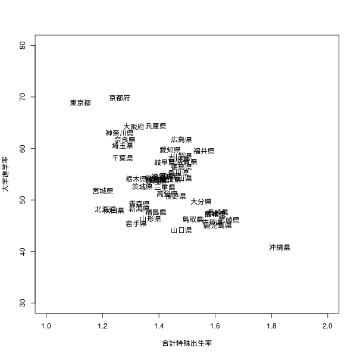

# 大学進学率の地域差

とある講義で、教育の地域格差を紹介されました。
[SSDSE（教育用標準データセット）](https://www.nstac.go.jp/use/literacy/ssdse/?doing_wp_cron=1702644632.9813399314880371093750)に、このテーマの議論に使えそうなものはないか探しました。

書いたRスクリプトは[ここ](../script/edu.R)から見られます。

## 高校卒業後の進学率の都道府県比較

SSDSE-県別推移（SSDSE-B）の項目に、「高等学校卒業者数」と「高等学校卒業者のうち進学者数」があるので、高校卒業後進学率の都道府県比較ができそうです。
（各項目の詳しい説明はe-statの[このページ](https://www.e-stat.go.jp/koumoku/koumoku_teigi/E#E46)に詳しく書いてあります。）

```R
data = read.csv("../data/SSDSE-B-2023.csv") # データを読み込み
data2020 = subset(data, 年度==2020) # 2020年度のデータのみ取り出す
grad = data.frame(pre=data2020$都道府県, ratio=data2020$高等学校卒業者のうち進学者数/grad$高等学校卒業者数*100) # 高校卒業後の進学率を計算し、データフレーム化する
```

このデータ内で最新の2020年度の各都道府県の高校卒業後進学率を計算しました。

高校卒業後進学率を比較するグラフを作成します。

```R
grad = data2020[order(grad$ratio, decreasing=FALSE),] # 降順に並べ替え
par(mar = c(5, 14, 4, 2) + 0.1)
barplot(grad$ratio, names.arg=grad$pre, las = 1, horiz = TRUE, main = "大学進学率2020")
```

次のような棒グラフが出来上がります。


1位は京都府、47位は沖縄県で、平成30年度都道府県別四年制大学進学率（文部科学省 学校基本調査）とは異なる結果になりました。
4年制大学に限らない進学率を扱っっているから結果が変わったのでしょうか。
それとも調査年が違うから？

## 合計特殊出生率と進学率

同じ講義内のディスカッションの時間に、1家庭当たりの子どもの数が少ないほうが、世話が手厚くなり、進学率が高くなるのではないかと考えているグループがありました。

これも、SSDSE-県別推移（SSDSE-B）から何か調べてみたいです。
データの項目に「合計特殊出生率」があります。
これを1家庭あたりの子どもの数の比較に用います（←これまずくないですよね？）

```R
fert = data.frame(pre=data2020$都道府県, ratio=data2020$高等学校卒業者のうち進学者数/grad$高等学校卒業者数*100, bir=data2020$合計特殊出生率)
fert = fert[order(fert$bir, decreasing=FALSE),]
plot(NULL, xlim=c(1,2), ylim=c(30,80),
xlab="合計特殊出生率", ylab="高校卒業後進学率％")
text(fert$bir, fert$ratio, fert$pre)
```

これを実行すると、合計特殊出生率と高校卒業後進学率を比較するグラフができます。



合計特殊出生率が大きいほど高校卒業後進学率が低いように見え（る気がし）ます。

相関係数は、次のようになりました。

```R
> cor(fert$bir, fert$ratio)
[1] -0.4976173
```

相関が強いとは言えませんが、負の相関はありそうです。
合計特殊出生率と高校卒業後進学率の相関の背後にどのような要因があるのでしょう。

（未完）
