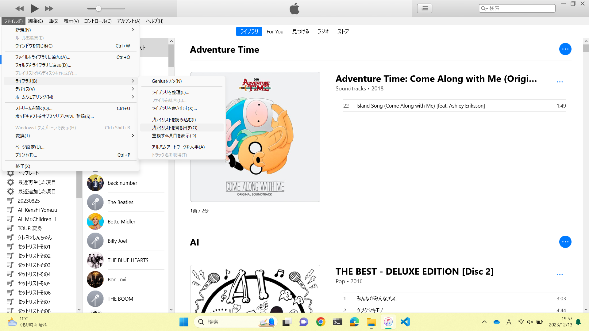
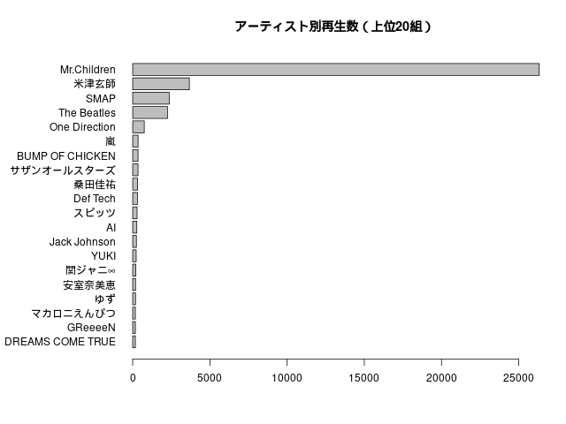
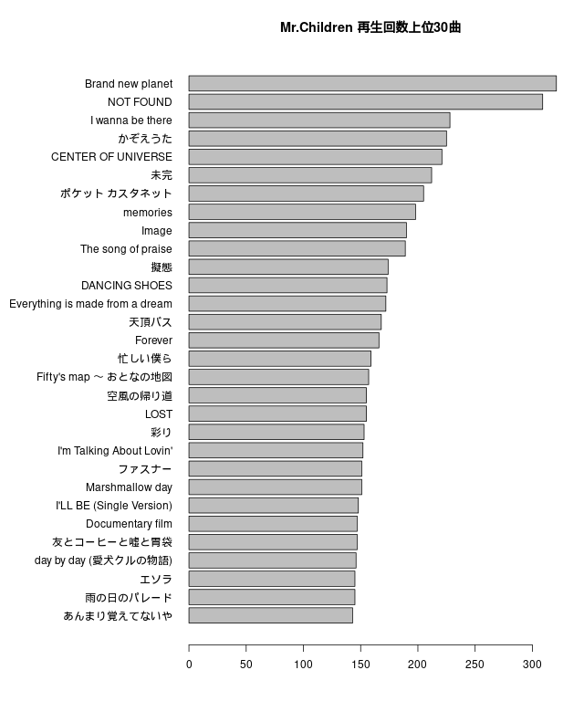

<!---
itunesのデータをみる
-->

# iTunesのライブラリ情報を調べる

iTunesの再生記録を調べる方法を調べてみると、XMLファイルをpythonで解析する記事はあったものの、Rを使っている人はいなかったので、ここに記録を残しておきます。
以下は、ずぶんのiTunesデータでの例です。

## CSVファイル取得まで

iTunesアプリを立ち上げ、リボンの**ファイル**>**ライブラリ**>**プレイリストを書き出す**で、txtファイルを作成できると思います。



作成したファイルを手帳アプリか何かで開いて、CSVファイル形式で保存しなおします。
（ずぶんはWSLのLinuxでRを使いたいので、CSV UTF-8 （コンマ区切り）で保存しました。ちなみに来週MacBook Airが届くのでShift-JISとはおさらばです。うふふ）

## Rで読み込む

Rを立ち上げて、作ったファイル（ここではmusic.csvという名前で保存したことにします）を読み込みましょう。

```
data = read.csv("music.csv")
```

ところで、`data`にはどのような記録が記されているのでしょうか。
確認してみましょう。

```
> names(data)
 [1] "名前"                 "アーティスト"         "作曲者"              
 [4] "アルバム"             "グループ"             "作品"                
 [7] "楽章番号"             "楽章数"               "楽章名"              
[10] "ジャンル"             "サイズ"               "時間"                
[13] "ディスク番号"         "ディスク数"           "トラック番号"        
[16] "トラック数"           "年"                   "変更日"              
[19] "追加日"               "ビットレート"         "サンプルレート"      
[22] "音量調整"             "種類"                 "イコライザ"          
[25] "コメント"             "再生回数"             "最後に再生した日"    
[28] "スキップ回数"         "最後にスキップした日" "マイ評価"            
[31] "場所"                
```

## アーティストごとに再生回数を集計

**アーティスト**ごとに**再生回数**を集計して、ランキングを作ってみるのが面白そうです（たぶんiTunesアプリでこれを確認することはできないのでなおさら）。

```
count = tapply(data$再生回数, data$アーティスト, sum, na.rm=TRUE)
count = data.frame(artist=names(count), plays=count)
count = count[order(count$plays, decreasing=TRUE),]
count = head(count, 20)
```

変数名全部countで地獄のようですね。
すいません。
`tapply`関数でアーティストごとに再生回数を合計し、それをデータフレームにしました（1・2行目）。
そして、再生回数が多い順に20組だけ残しました（3・4行目）。

グラフにして、データを見ましょう。

```
count = count[order(count$plays, decreasing=FALSE),]
par(mar = c(5, 10, 4, 2) + 0.1)
barplot(count$plays, names.arg=count$artist, las=1, horiz=TRUE, main="アーティスト別再生数（上位20組）")
```

アーティスト名が長いので、縦軸にアーティスト名、横軸に再生回数を表示する棒グラフを作成することにします。
再生回数が多いアーティストを上から順に示したいので、一度`count`を昇順に並び替えました（1行目）。
アーティスト名が左にはみ出すので、余白を変更しました`mar = c(5, 10, 4, 2) + 0.1`のように変更しました（2行目）。
（デフォルトは`c(5, 4, 4, 2) + 0.1`になっています。）
3行目の`las=1`は、横軸と縦軸のラベルを横書きで示すためのものです。
同じく3行目の`horiz=TRUE`は、棒グラフを横向きにするための記述です。

これで、次のようなグラフができました。



彼はMr.Childrenが大好きで仕方がないようです。

## 各アーティストごとの再生回数上位曲

例として、[Mr.Children](https://www.mrchildren.jp/)の曲のうち、再生回数が上位30のものを表示しましょう。

```
MrChildren = subset(data, アーティスト=="Mr.Children")
MrChildren = MrChildren[order(MrChildren$再生回数, decreasing=TRUE),]
MrChildren = head(MrChildren, 30)  # 上位30曲
```

`data`の中からMr.Childrenの行だけ抽出し（1行目）、再生回数が多い順に並べ替え（2行目）、トップ30の曲を抜き取ります（3行目）。

先ほどと同様に、棒グラフを作りましょう。

```
MrChildren = MrChildren[order(MrChildren$再生回数, decreasing=FALSE),]
par(mar = c(5, 14, 4, 2) + 0.1)
barplot(MrChildren$再生回数, names.arg = MrChildren$名前, las = 1, horiz = TRUE, main = "Mr.Children 再生回数上位30曲")
```

結果は次のようになりました。



上位2曲が頭一つ抜きんでていますね（何なら今NOT FOUNDかかっています）。
day by day （愛犬クルの物語）が入っているのは意外です。

こうやって自分の視聴履歴を振り返るのは意外と楽しいもんです。

（未完🍊）
